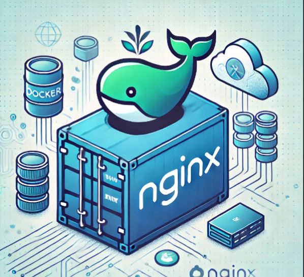
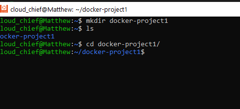
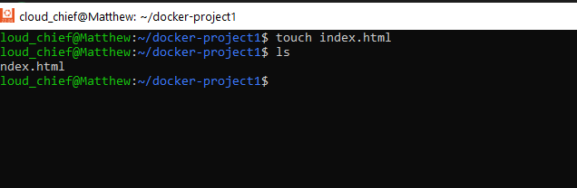
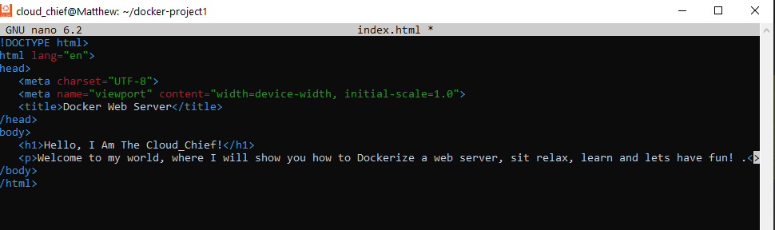
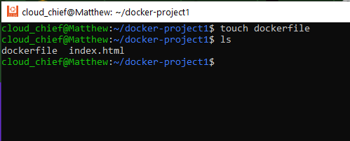
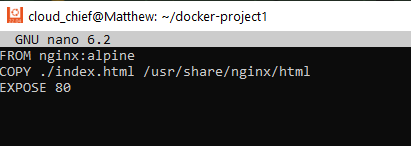
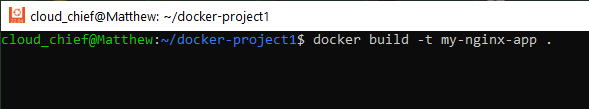
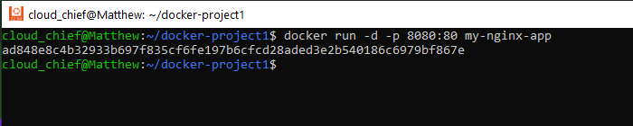
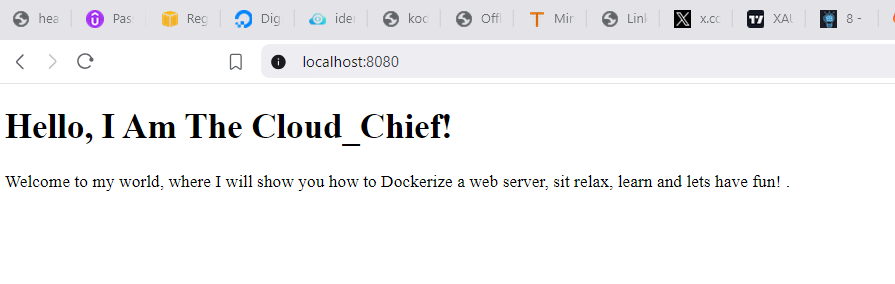

# Effortless Web Hosting: Build and Run an NGINX Server with Docker

## Introduction
Docker has transformed the way we deploy applications, making processes more efficient and consistent. Whether you're developing locally or deploying to production, Docker ensures your web server behaves the same way, regardless of where it’s running. 

This guide will walk you through the process of creating an NGINX web server using Docker, providing a hands-on approach and practical insights along the way.

Why Use Docker for Your NGINX Web Server?
In traditional setups, creating an environment for your web server often involves installing and configuring software manually on each platform. 

With Docker, you can package your server and its dependencies into a container that runs seamlessly anywhere. This approach is particularly useful for developers and DevOps engineers who need consistency across development, staging, and production environments.

## Benefits of Using Docker:

### Consistency:
 Containers ensure your server runs the same way in all environments.
### Portability: 
Easily move your containerized server across various platforms and clouds.
### Rapid Deployment:
 Go from code to running application within minutes.
### Step-by-Step Guide to Deploying an NGINX Web Server with Docker

**Step 1: Set Up Your Project Directory**

Start by creating a directory for your project. This will help keep all your files organized.

```
mkdir docker-project1
cd docker-project 
```


**Step 2: Create Your Web Content**

Create a simple index.html file that will serve as the homepage for your web server.

```
touch index.html
nano index.html
```



Add some basic content to your index.html file:



***Step 3: Write Your Dockerfile**

The Dockerfile is the blueprint for building your Docker image. It contains instructions for setting up your environment. Create a ***Dockerfile*** in your project directory:

```
touch Dockerfile
nano Dockerfile
```

Add the following lines to your Dockerfile:

```
# Use the official NGINX base image
FROM nginx:alpine

# Copy the content of your HTML file to the default NGINX directory
COPY index.html /usr/share/nginx/html/index.html

```


### Explanation of the Dockerfile:

* **FROM nginx**
: Specifies the lightweight NGINX base image to use.
* **COPY:** Transfers your ***index.html*** file into the appropriate directory within the container.

**Step 4: Build Your Docker Image**

With your Dockerfile ready, build your Docker image by running:

```
docker build -t my-nginx-server .

```


This command creates an image named ***my-nginx-server*** based on your Dockerfile.

**Step 5: Run Your NGINX Container**

Start your container using the following command:
```
docker run -d -p 8080:80 my-nginx-server
```


* -d: Runs the container in detached mode.
* -p 8080:80: Maps port 8080 on your machine to port 80 inside the container.

**Step 6: Access Your Web Server**
Open your web browser and navigate to  ***http://localhost:8080.*** You should see your **"HTML!"** message displayed, confirming that your **NGINX** server is up and running inside a Docker container.


### Real-Life Use Case
Imagine a scenario where a software development team needs to quickly test changes to their website before deploying to production.

 By containerizing their NGINX server, they can ensure that everyone on the team sees the same results locally as they would in a staging or production environment. 
 
 This dramatically reduces the risk of discrepancies due to "it works on my machine" issues.

### Conclusion
Setting up an NGINX web server with Docker streamlines your deployment process, making it easier to create, test, and run web servers consistently across various environments. 

This guide shows how simple it is to build and launch your server using Docker's powerful yet user-friendly tools.

Start using Docker for your projects today, and unlock a new level of efficiency and consistency in your deployments!
